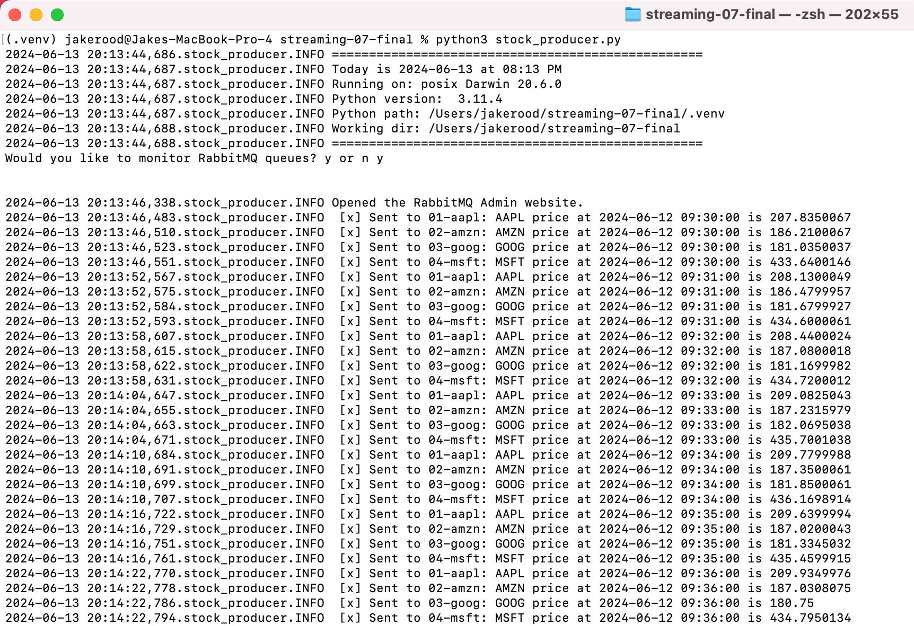
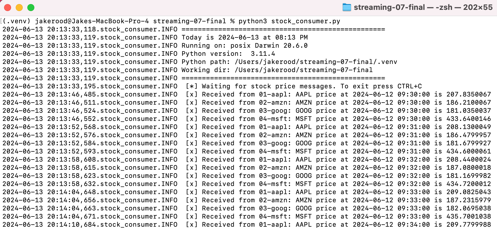
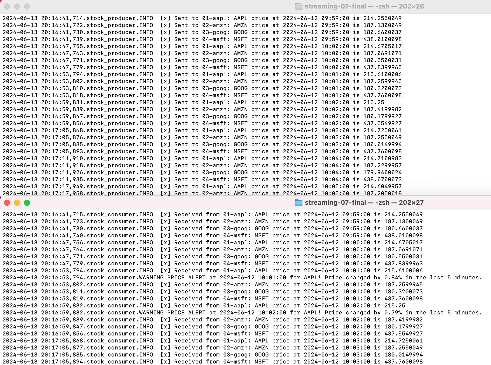
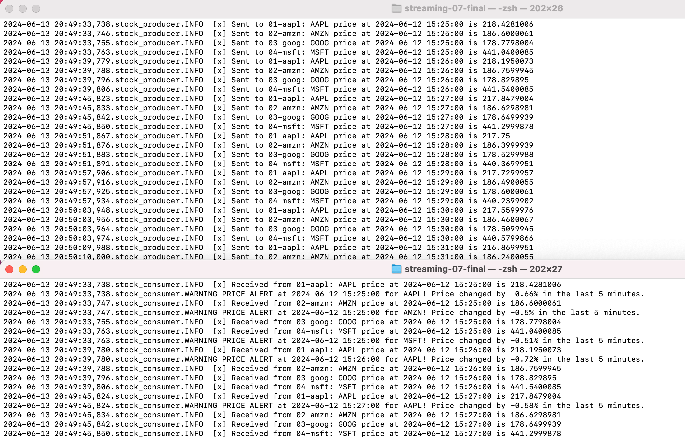
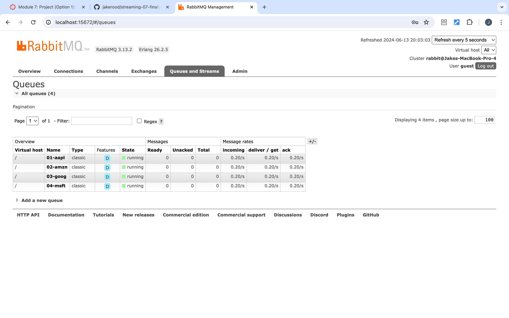

# streaming-07-final

> Name: Jake Rood \
Date: June 13, 2024

In this project, we use RabbitMQ to stream stock prices using one producer and one consumer with four different queues.

Stock prices for four different stocks are streamed in this project:

* Apple Inc (AAPL)
* Amazon.com Inc (AMZN)
* Alphabet Inc Class C (GOOG)
* Microsoft Corp (MSFT)

First, we'll design our system and implement the producer. Then, we'll add the consumer, implementing analytics based on a rolling window of time. We will raise an alert when significant price changes are detected.

## Prerequisites

1. Git
1. Python 3.7+ (3.11+ preferred)
1. VS Code Editor
1. RabbitMQ Server installed and running locally

## Before You Begin

1. Fork this starter repo into your GitHub.
1. Clone your repo down to your machine.

## Create a Python Virtual Environment

We will create a local Python virtual environment to isolate our project's third-party dependencies from other projects.

1. Open a terminal window in VS Code.
1. Use the built-in Python utility venv to create a new virtual environment named `.venv` in the current directory.

```shell
python3 -m venv .venv
```

Verify you get a new .venv directory in your project. 
We use .venv as the name to keep it away from our project files. 

## Activate the Virtual Environment

In the same VS Code terminal window, activate the virtual environment. On MacOS:

```shell
source .venv/bin/activate
```

Verify you see the virtual environment name (.venv) in your terminal prompt.

## Install Dependencies into the Virtual Environment

To work with RabbitMQ, we need to install the pika library.
A library is a collection of code that we can use in our own code.

We keep the list of third-party libraries needed in a file named requirements.txt.
Use the pip utility to install the libraries listed in requirements.txt into our active virtual environment. 

Make sure you can see the .venv name in your terminal prompt before running this command.

```shell
python3 -m pip install -r requirements.txt
```

## Stock Producer

We want to continuously stream stock prices for four different stocks. Information is stored in the "stock-prices.csv" file. Prices are updated every minute, so read values every minute (sleep_secs = 60).

"stock-prices.csv" has 5 columns:

[0] Time (EDT) = Date-time stamp for the stock price\
[1] AAPL = AAPL price --> send to message queue "01-aapl"\
[2] AMZN = AMZN price --> send to message queue "02-amzn"\
[3] GOOG = GOOG price --> send to message queue "03-goog"\
[4] MSFT = MSFT price --> send to message queue "04-msft"

The file "stock_producer.py" is the producer for this process. The script reads the values from the "stock-prices.csv" file and sends the messages to appropriate queue.

To run the producer, open a terminal and run the following command:

```shell
python3 stock_producer.py
```

The program will begin reading values from the CSV file and sending messages to the appropriate queue. Hit `CTRL+C` to manually interrupt the process.

Below is a screenshot of the stock producer running



## Stock Consumer

We will use one consumer that receives messages from four different queues. The file "stock_consumer.py" is the consumer for this process. It receives messages from the following queues:

* 01-aapl --> receives message containing AAPL price
* 02-amzn --> receives message containing AMZN price
* 03-goog --> receives message containing GOOG price
* 04-msft --> receives message containing MSFT price

To run the stock consumer, open a second terminal and run the following command:

```shell
python3 stock_consumer.py
```

The program will begin waiting for messages from the four queues. Hit `CTRL+C` to manually interrupt the process.

Below is a screenshot of the stock consumer running



## Alerts

An alert is triggered by the consumer for any of the four stocks if the following occurs:

> Stock price changes (increases or decreases) by 0.5% or more in 5 minutes

This triggers a PRICE ALERT. See the below screenshots for examples of a triggered PRICE ALERT (see bottom terminal):





## RabbitMQ Admin

RabbitMQ comes with an admin panel. When you run the stock producer, reply y to open it.

Below is a screenshot of the RabbitMQ admin panel showing the four queues in our process running.




## Sync Changes to GitHub
Once finished, it's time to get the local work you did on your machine back up to your cloud repo in GitHub:

1. On the VS Code side panel, click the source control icon (look for a blue bubble with a number in it).
1. Important! Above the Commit button, it will say "Message".
1. You MUST include a commit message.
1. Click the down arrow on the blue "Commit" button to "Commit and Push" to your GitHub repo.

Verify: Open a browser to your GitHub repo and verify the changes have appeared.

Note: You can either sync all your changes at once at the end of the project OR you can sync your changes after completing each task individually.
